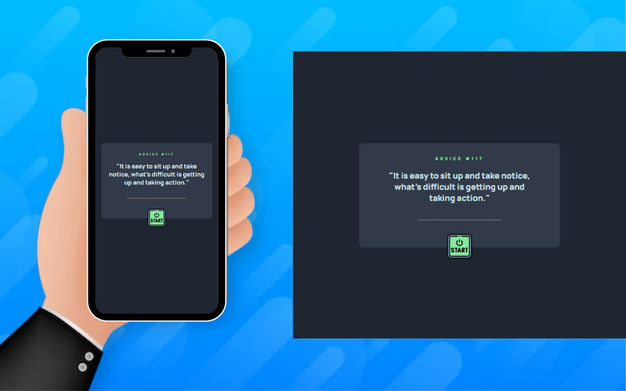

<h1 align="center">Advanced HTML + CSS Exercise - Part 1 - Advice Generator</h1>

()

You should create a layout close to this mentor frontend challenge: <a href="https://www.frontendmentor.io/challenges/advice-generator-app-QdUG-13db">Frontend Mentor | Advice generator app coding challenge</a>. Where the main challenge is to build an application that generates random advice. In this first stage of the exercise, only the construction of HTML and CSS will be carried out.

<h4 align="center"> 
    :construction:  Conclude  :construction:
</h4>